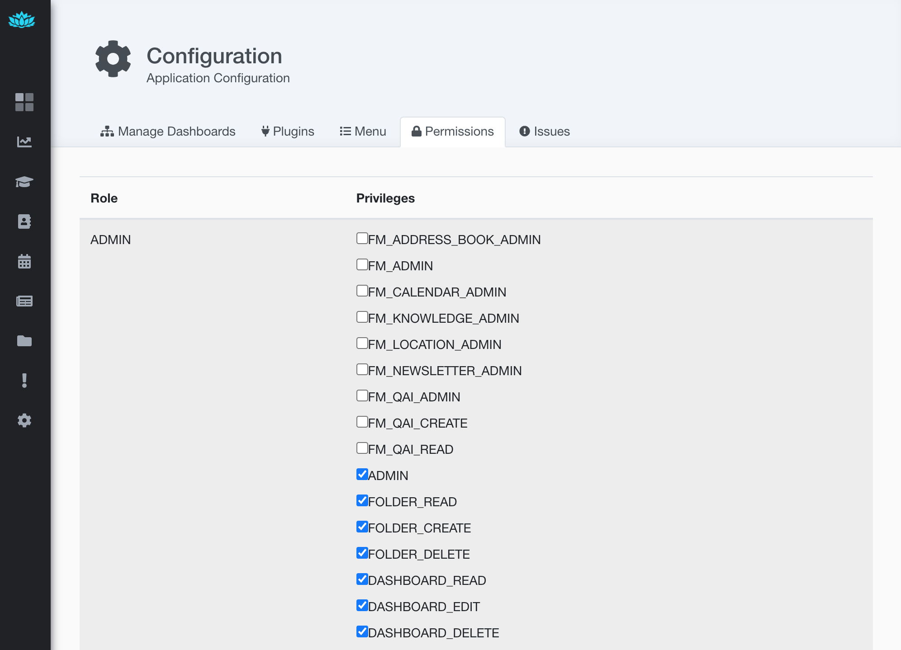
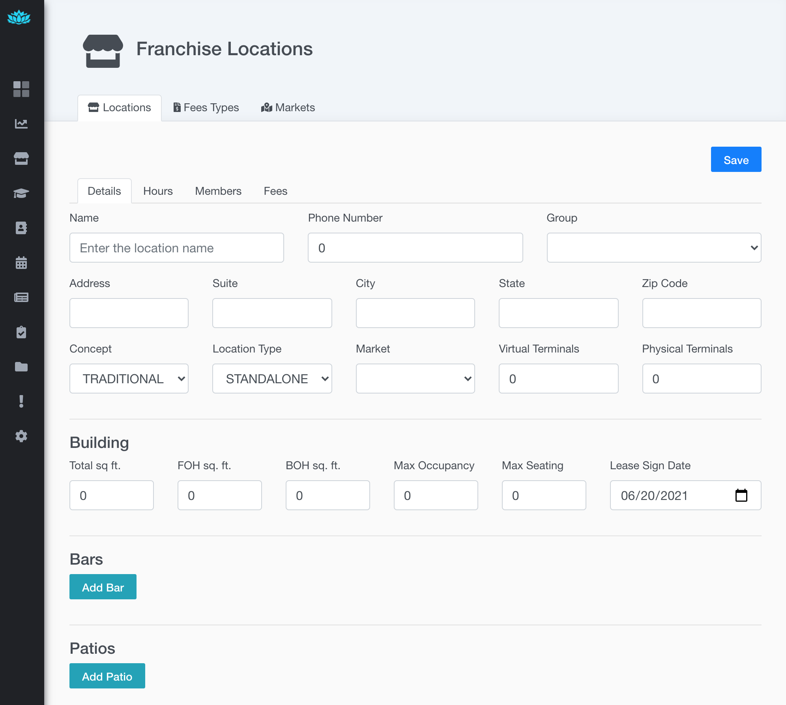
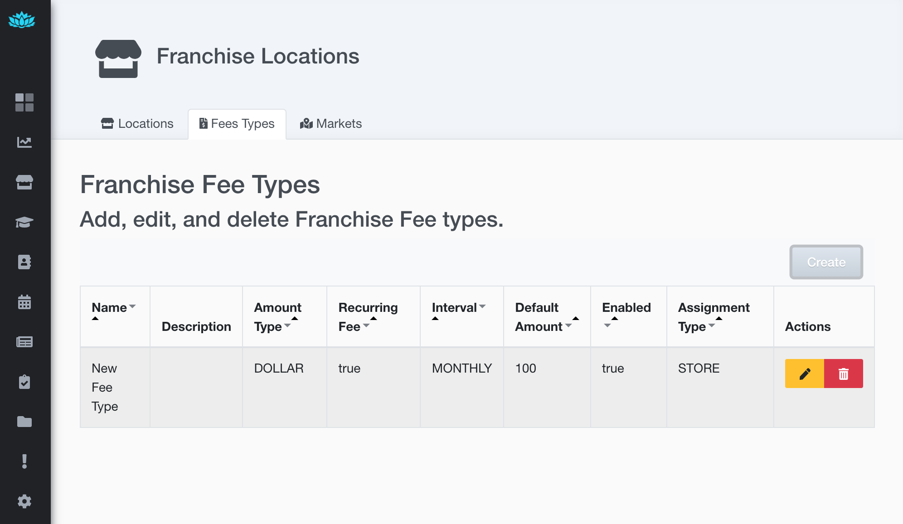
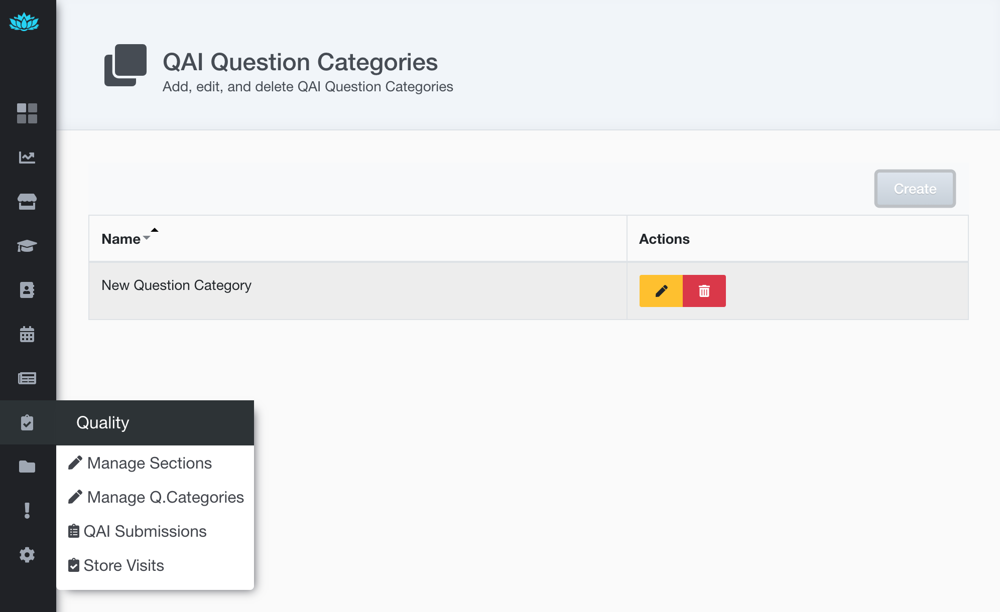
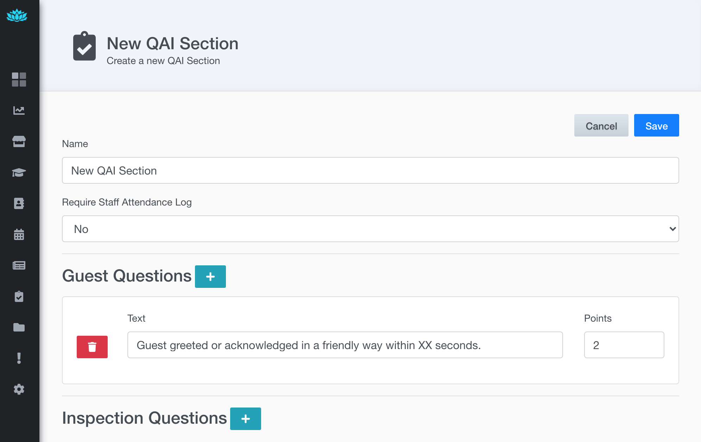
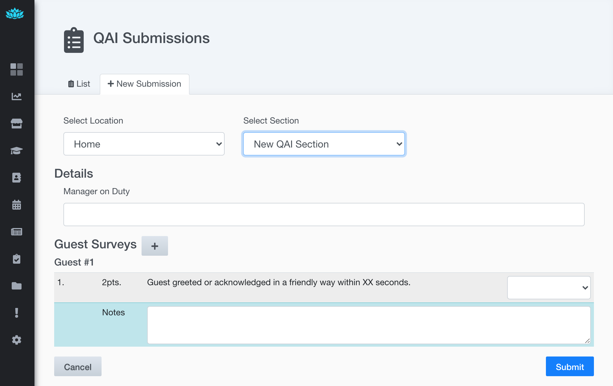

# Franchise Manager 
The franchise manager module provides basic line-of-business data management for managing franchises.  
It's developed as a Sprout Module to take advantage of the pluggable nature of Sprout.  
Both Sprout and Franchise Module are dependencies that can be added to a Java Spring Boot application, to facilitate extension, customization, and easy upgrades.  

Read more about the Sprout Project -  
[https://github.com/savantly-net/sprout-platform](https://github.com/savantly-net/sprout-platform)


## Quick start

### Example
[Example server](./example) using the Franchise Manager module.  
Run the docker compose to set the example environment.  

```
docker compose -f example/docker-compose.yml up
```

Access the front-end at [http://localhost:3000](http://localhost:3000) 
with the default user/pass `admin/changeme!`

Postgres Adminer is exposed at `localhost:8081`

To remove the containers -  

```
docker compose -f example/docker-compose.yml rm
```

To build the image - 
```
./gradlew :fm-example:bootBuildImage
```

### Module
The Franchise Manager module for the Sprout Platform.   
The module is packaged as a jar, and contains backend and frontend code.  

#### Development 
In one terminal start the Java dev continuous build.  

```
./gradlew :fm-module:compileJava --continuous
```

In another terminal, start the required resourses [DB, WebApp]

```
docker compose -f module/docker-compose.yml up
```

Finally in another terminal, start the dev app -  

```
./gradlew :fm-module:bootRun
```

To continuously build the plugin/front-end code, open another terminal - 
This allows seamless development of the front-end code. Refresh the browser to see updates.  

```
cd module
yarn watch
```

Sprout UI should be running at [localhost:3000](http://localhost:3000)  
Sprout API should be running at [localhost:8080](http://localhost:8080)  
Adminer should be running at [localhost:8081](http://localhost:8081)  

## Features

Home page showing the menu options added by the Franchise Manager module  
  

## Permissions  
New permissions available  
  

### Location Management

Manage franchise location information -  
Add attributes such as address, bars, patios, POS terminals, and others ...  

Locations List  
  

Location Edit   
  

### Franchise fee management  

Manage the fees associated with a franchise.  

Fee Types   
  

Fee Type Edit   
  

### QAI 

Manage the QAI surveys and 'store visit' forms.  
Create multiple sections, question categories, questions, and associated points  

QAI Question Category List
  

QAI Section Editor  
  

QAI Section Data Entry  
  