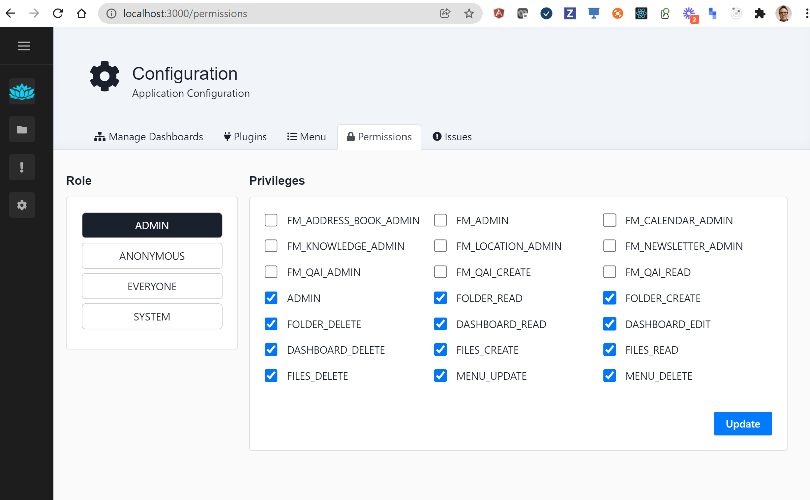
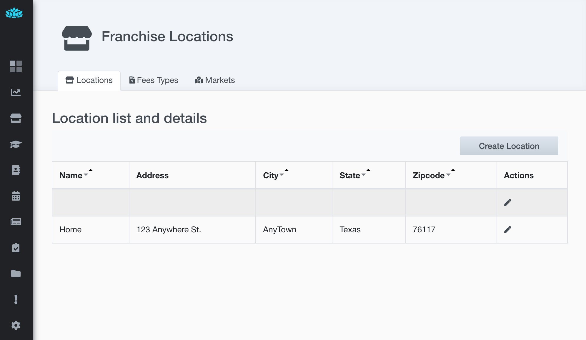
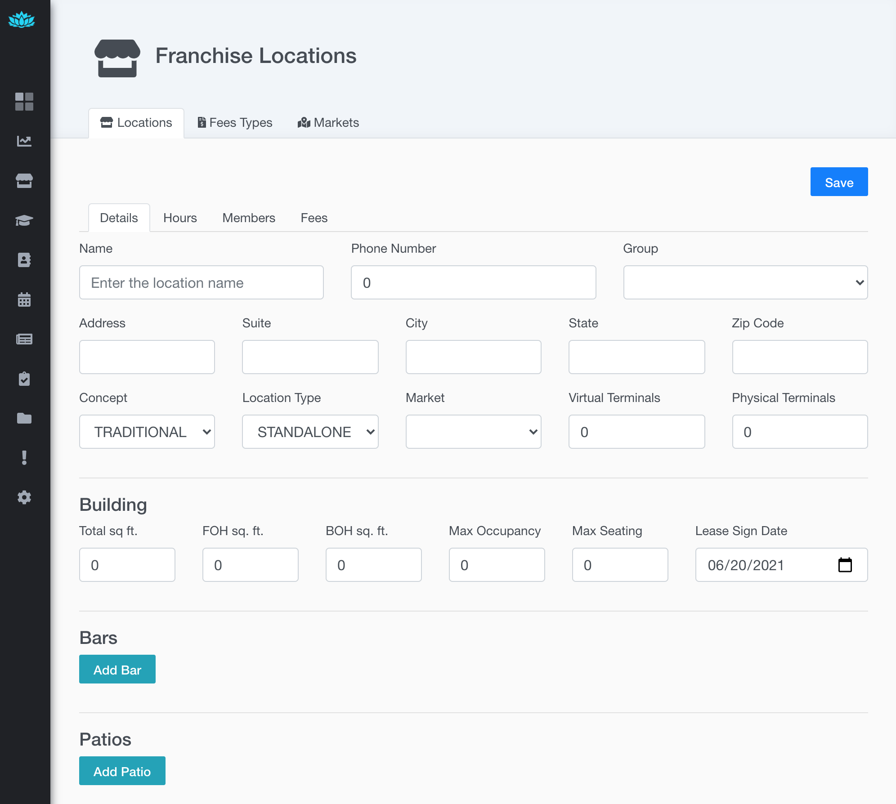
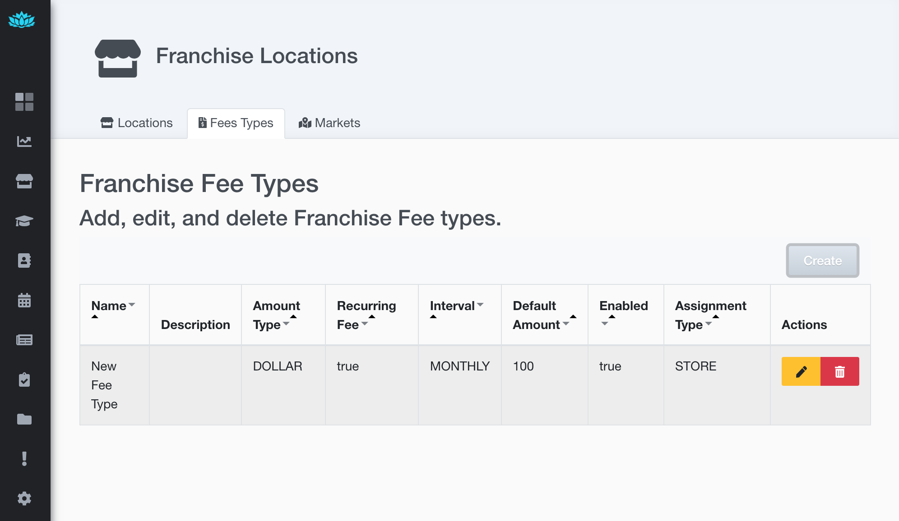
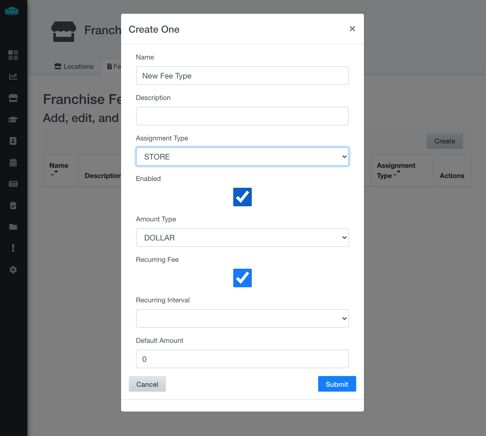
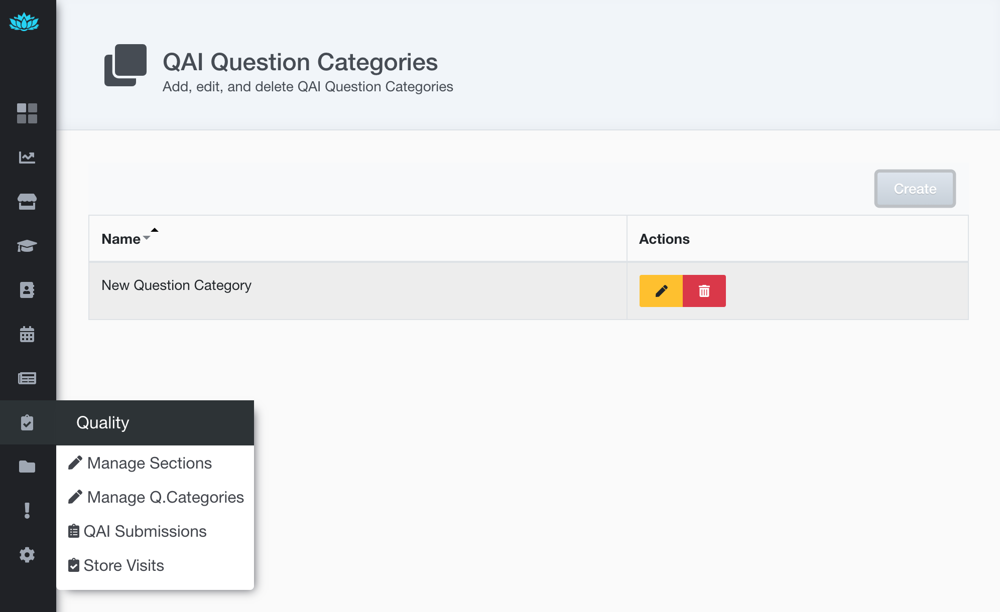
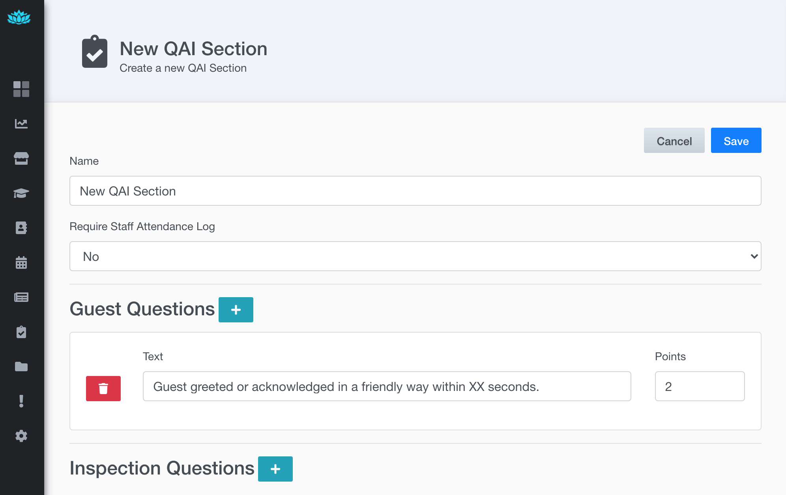
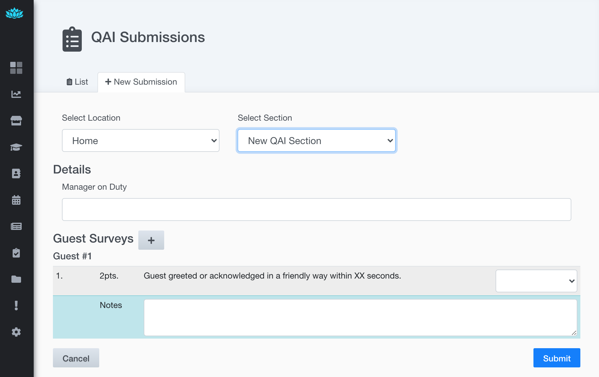

## Deprecated
Check out the new Multi-Brand & Multi-Site management app - "Nexus Command"  
https://github.com/savantly-net/nexus-command  


# Franchise Manager 
The franchise manager module provides basic line-of-business data management for managing franchises.  
It's developed as a Sprout Module to take advantage of the pluggable nature of Sprout.  
Both Sprout and Franchise Module are dependencies that can be added to a Java Spring Boot application, to facilitate extension, customization, and easy upgrades.   

Read more about the Sprout Project -  
[https://github.com/savantly-net/sprout-platform](https://github.com/savantly-net/sprout-platform)

## Usage
To use the Franchise Manager plugin in your own Sprout application, include it as a dependency.  
For snapshots, be sure to add the OSS Sonatype snapshot repository -  

`maven url('https://oss.sonatype.org/content/repositories/snapshots/')`


Maven - 
```
<dependency>
  <groupId>net.savantly.franchise</groupId>
  <artifactId>franchise-manager</artifactId>
  <version>2.0.1-SNAPSHOT</version>
</dependency>
```

Gradle - 
```
implementation 'net.savantly.franchise:franchise-manager:2.0.1-SNAPSHOT'
```

## Quick start

## Demo 
Access a running [demo here](https://franchise-manager.herokuapp.com/)  
Login with -  
- username: admin
- password: changeme!

### Example
To run the demo locally, start the [Example server](./example) using the Franchise Manager module.  
Run the docker compose to setup the example environment.  

```
docker compose -f example/docker-compose.yml up
```

Access the front-end at [http://localhost:3000](http://localhost:3000) 
with the default user/pass `admin/changeme!`

To access the franchise-manager menu items, you may need to configure the permissions for the admin user.  

Postgres Adminer is exposed at `localhost:8081`

To remove the containers -  

```
docker compose -f example/docker-compose.yml rm
```

To build the image - 
```
./gradlew :fm-example:bootBuildImage
```

## Development 

See the development guide for more information.  
[./docs/development.md](./docs/development.md)

## Features

Home page showing the menu options added by the Franchise Manager module  
  

## Permissions  
New permissions available  
  

### Location Management

Manage franchise location information -  
Add attributes such as address, bars, patios, POS terminals, and others ...  

Locations List  
  

Location Edit   
  

### Franchise fee management  

Manage the fees associated with a franchise.  

Fee Types   
  

Fee Type Edit   
  

### QAI 

Manage the QAI surveys and 'store visit' forms.  
Create multiple sections, question categories, questions, and associated points  
See the [QA Setup Guide](./docs/qa.md) for more information.  

QAI Question Category List
  

QAI Section Editor  
  

QAI Section Data Entry  
  
